# DevSecOps Pipeline — Personal Task Manager


> End-to-end DevSecOps case study built during the **[Hackers do Bem](https://hackersdobem.org.br) DevSecOps Specialization (3rd cohort)** — a free, RNP/SENAI-backed national cybersecurity training program. A Python/Flask task manager was used as the target application to practice security engineering across the full SDLC: versioning → automated testing → containerization → CI/CD → SAST/SCA/DAST → SIEM monitoring.

> **⚠️ Educational lab, not production code.** The application intentionally contains a hardcoded secret key, an outdated dependency, and missing security headers — these are the realistic findings the pipeline below is designed to catch, not oversights.

## Table of Contents

- [Pipeline Overview](#pipeline-overview)
- [Tech Stack](#tech-stack)
- [What This Project Demonstrates](#what-this-project-demonstrates)
- [Stage 1 - Base Application](#stage-1---base-application)
- [Stage 2 - Versioning and Merge Requests](#stage-2---versioning-and-merge-requests)
- [Stage 3 - Automated Tests](#stage-3---automated-tests)
- [Stage 4 - Containerization](#stage-4---containerization)
- [Stage 5 - CI/CD Pipeline](#stage-5---cicd-pipeline-gitlab-ci)
- [Stage 6 - SAST and SCA](#stage-6---sast-static-security-analysis)
- [Stage 7 - DAST](#stage-7---dast-dynamic-security-analysis)
- [Stage 8 - SIEM Monitoring](#stage-8---siem-monitoring-with-wazuh-and-grafana)
- [Lessons Learned](#lessons-learned)
- [Getting Started](#getting-started)
- [License](#license)

## Pipeline Overview

```
test → scan (SAST + SCA + DAST) → build
```

Every push to GitLab triggers the pipeline automatically. The `scan` stage runs **Bandit**, **OWASP Dependency-Check**, and **OWASP ZAP** in parallel before the container image is built.

## Tech Stack

| Layer | Tools |
|---|---|
| Application | Python 3.11, Flask 2.3.2, SQLAlchemy, Flask-Login, Flask-WTF |
| Versioning | Git, GitLab, feature branches, Merge Requests |
| Testing | pytest, Flask test client, SQLite in-memory |
| Containerization | Docker, docker-compose, `python:3.11-slim` |
| CI/CD | GitLab CI/CD, Docker-in-Docker |
| SAST | Bandit 1.9.x |
| SCA | OWASP Dependency-Check |
| DAST | OWASP ZAP (Baseline Scan) |
| SIEM | Wazuh 4.14.5, Grafana 11.6.1, Loki 3.4.3, Promtail |

## What This Project Demonstrates

- Designing a 3-stage GitLab CI/CD pipeline (`test → scan → build`) that is required to pass before merging
- Integrating SAST, SCA, and DAST tools into a single pipeline and triaging their findings
- Git Flow with feature branches and merge requests gated on pipeline status
- Containerizing a Flask app for dev/CI parity between local runs and the DAST scan target
- Building a SIEM pipeline (Wazuh → Promtail → Loki → Grafana) with custom detection rules mapped to MITRE ATT&CK

## Stage 1 - Base Application

A personal task manager with user authentication, CRUD operations, and per-owner access control. Intentional vulnerabilities were introduced to create a realistic DevSecOps target:

- `SECRET_KEY` hardcoded in source
- Missing `SESSION_COOKIE_SECURE` and CSP headers
- Outdated Jinja2 3.1.3 (XSS CVE)

## Stage 2 - Versioning and Merge Requests

Git Flow with `feature/*` branches. The CI pipeline runs automatically on every push and must pass before a merge request can be merged.

| MR | Description |
|---|---|
| `feat/authentication-hardening` | Added `SESSION_COOKIE_HTTPONLY` and `SAMESITE` protections |
| `feat/task-search` | Task search feature, pipeline green before merge |

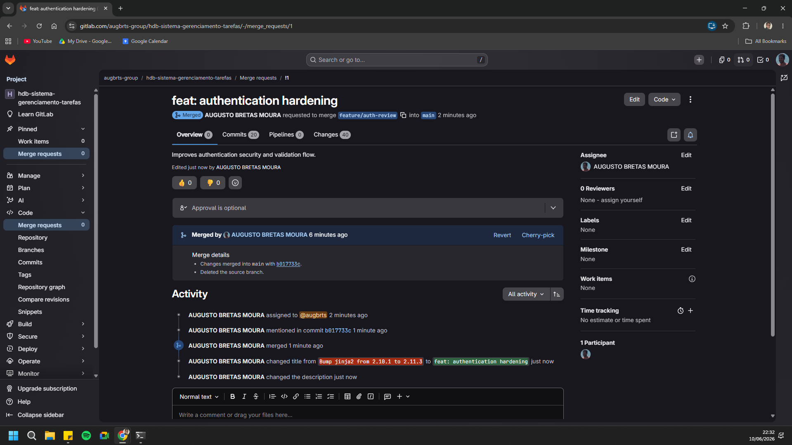
*MR `feat/authentication-hardening` — approved and merged into `main` after a green pipeline.*

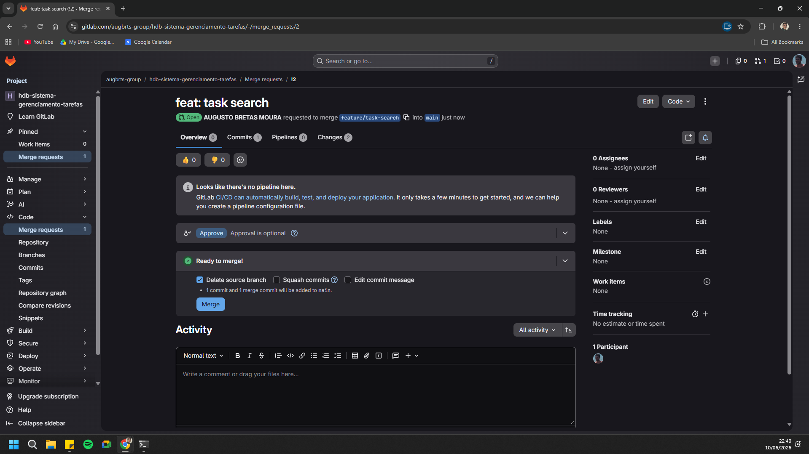
*MR `feat/task-search` — pipeline passing, ready to merge.*

## Stage 3 - Automated Tests

A pytest suite covering authentication flows, task CRUD, access control, and redirect validation. Tests run in an isolated Python 3.11 container on every push — **no security stage runs unless tests pass first.**

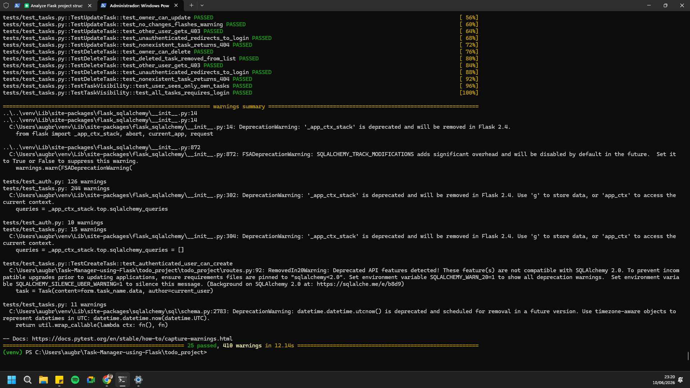
*Full suite passing in 12.14s. SQLAlchemy deprecation warnings are visible but non-blocking.*

## Stage 4 - Containerization

The application is packaged with a `python:3.11-slim` base image to reduce attack surface. The same Dockerfile used locally is reused by the DAST stage as the ZAP scan target, ensuring dev/CI parity.

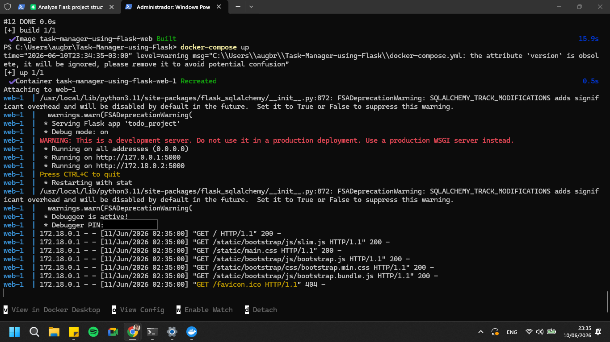
*`docker compose up` — Flask application started with real-time logs. (Werkzeug debugger PIN redacted.)*

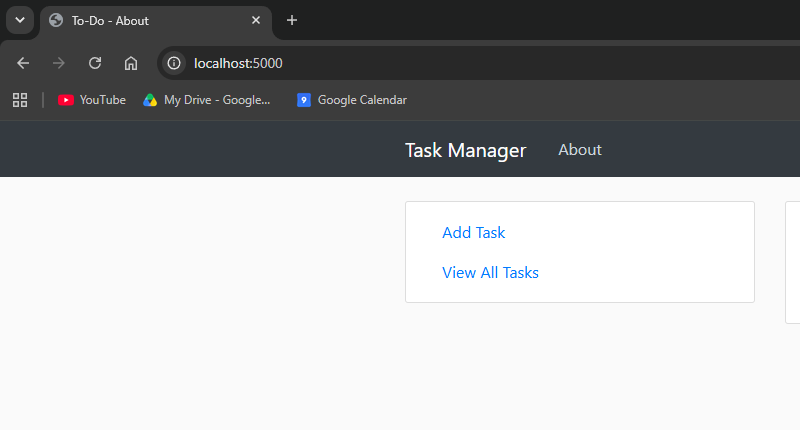
*Task Manager running at `localhost:5000`.*

## Stage 5 - CI/CD Pipeline (GitLab CI)

A three-stage pipeline defined in `.gitlab-ci.yml`. The `scan` stage runs all three security tools in parallel with `allow_failure: true`, to preserve build continuity while still collecting evidence.

```yaml
stages:
  - test
  - scan
  - build
```

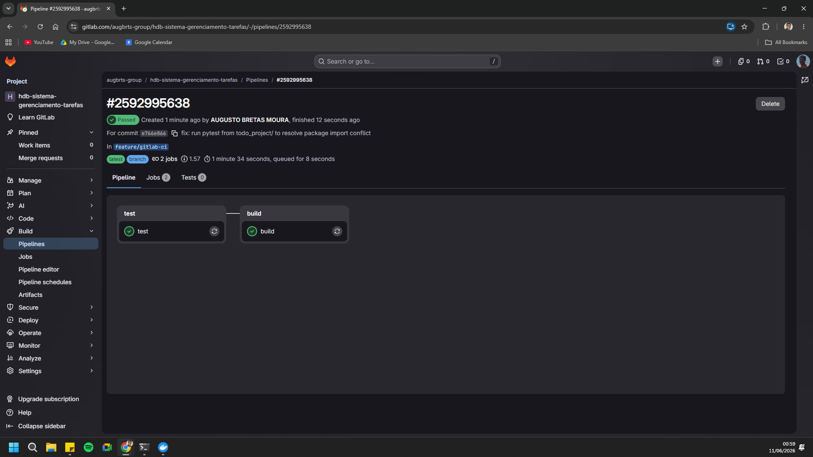
*Pipeline — test and build successful. The `scan` stage executes Bandit, OWASP Dependency-Check, and ZAP in parallel.*

> **Lesson learned:** GitLab's reserved `dast` stage name (Ultimate tier) causes immediate pipeline failure on lower tiers — renaming it to `scan` resolved it.

## Stage 6 - SAST: Static Security Analysis

Bandit analyzes Python source code for known insecure patterns. OWASP Dependency-Check performs SCA against the NVD/CVE database.

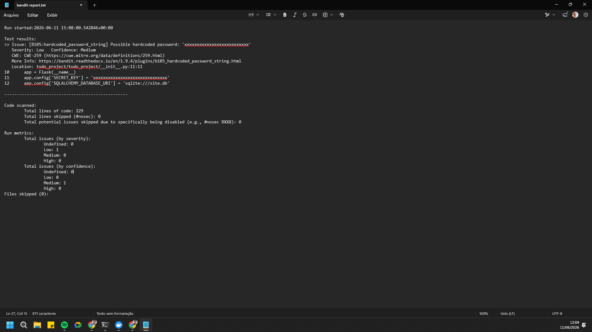
*Bandit — `B105` (CWE-259): hardcoded `SECRET_KEY` detected in `__init__.py:11`. Severity: Low, Confidence: Medium.*

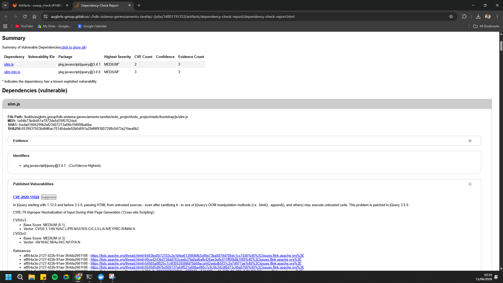
*OWASP Dependency-Check — Jinja2 3.1.3 flagged with an XSS CVE (Medium); `pyjwt` outdated.*

**Findings:**
- `B105` — hardcoded `SECRET_KEY` (kept intentionally for demonstration)
- Jinja2 3.1.3 — Cross-Site Scripting vulnerability
- Outdated transitive dependencies detected by SCA but invisible to SAST

## Stage 7 - DAST: Dynamic Security Analysis

OWASP ZAP Baseline Scan runs against the containerized application inside the CI pipeline, in an isolated `zapnet` Docker network.

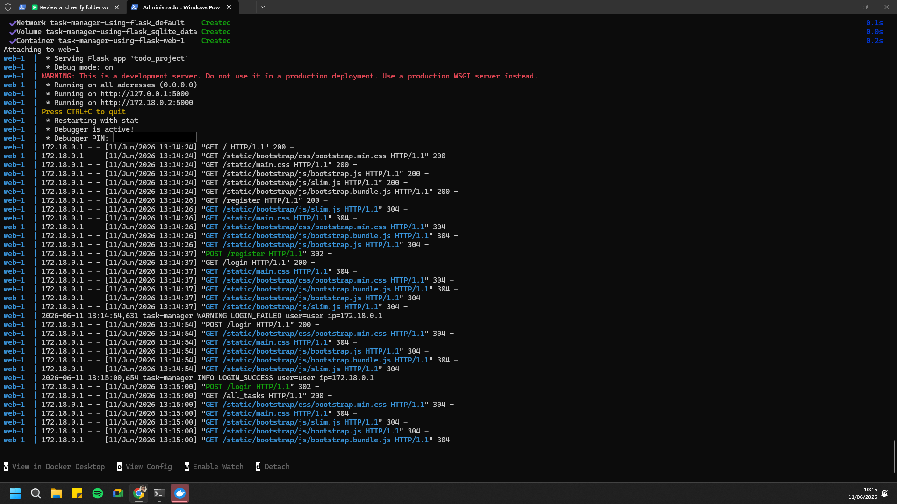
*Flask container logs during the ZAP scan — automated crawler requests and `LOGIN_FAILED` events visible.*

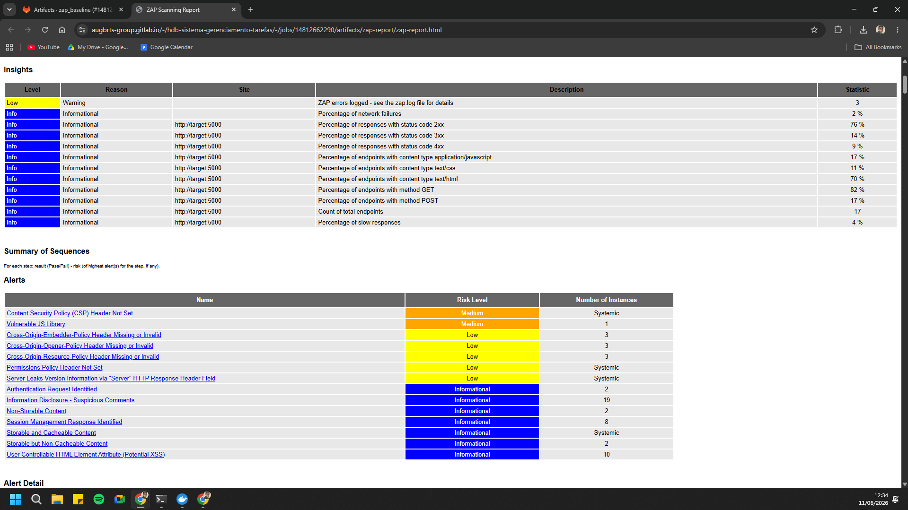
*ZAP Baseline Report — alerts for missing CSP, `X-Content-Type-Options`, `Permissions-Policy`, and CORP headers.*

**Findings:**
- Missing `Content-Security-Policy` header
- `Server` header exposing version information
- Missing `Permissions-Policy` and `Cross-Origin-Resource-Policy`

> **Pipeline design note:** in this project the DAST job builds its own Docker image internally (via Docker-in-Docker) and runs *before* the official `build` stage. The findings are equally valid since the source code is identical, but in a production pipeline DAST should run *after* `build` — pulling the published image from the registry to guarantee that the artifact scanned is byte-for-byte the same one that gets deployed.

## Stage 8 - SIEM: Monitoring with Wazuh and Grafana

The Wazuh agent on Windows collects Flask container logs via a PowerShell script (`docker logs -f` piped into a syslog file with `program_name: task-manager`). The Wazuh Manager processes them with custom decoders, Promtail ships them to Loki, and Grafana visualizes them via LogQL.

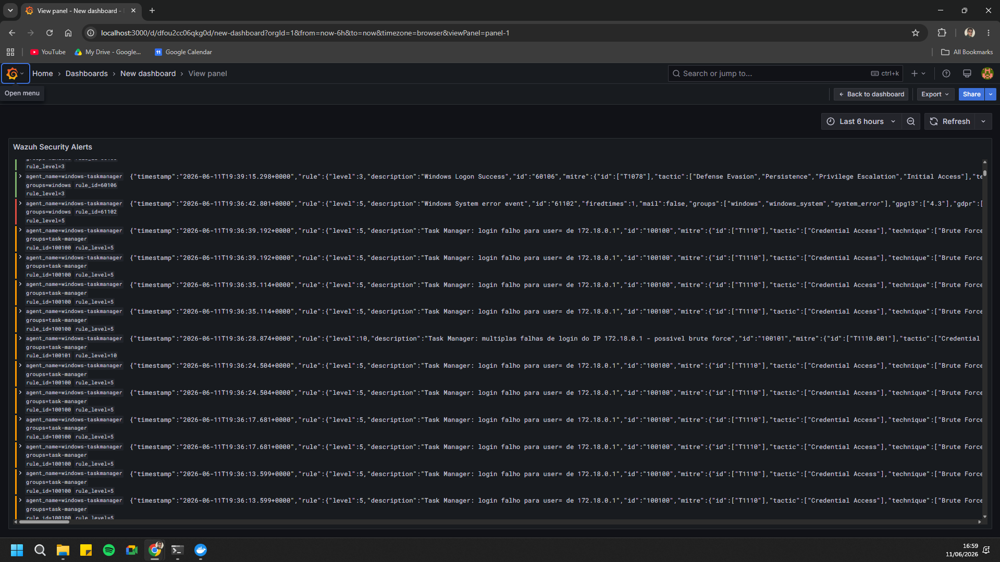
*Grafana — "Wazuh Security Alerts" dashboard: `LOGIN_FAILED` (rule 100100, level 5) and brute-force (rule 100101, level 10) events from the Task Manager, indexed via Promtail/Loki.*

**Custom detection rules (MITRE ATT&CK mapped):**

| Rule | Event | Technique |
|---|---|---|
| 100100 | `LOGIN_FAILED` | T1110 – Brute Force |
| 100101 | Brute-force threshold | T1110.001 |
| 100102 | `ACCESS_DENIED` | — |
| 100104 | Privilege escalation | T1068 |

## Lessons Learned

- GitLab's **reserved `dast` stage name** (Ultimate tier) fails the pipeline outright on lower tiers; renaming the stage to `scan` resolved it.
- DAST stage ordering matters: scanning the image **before** `build` is fine for proof-of-concept evidence, but a production pipeline should scan the **published artifact** to guarantee parity between what's tested and what's deployed.
- SCA catches transitive-dependency CVEs that SAST tools never see, since SAST only analyzes first-party source code.
- `allow_failure: true` on security stages keeps the pipeline green for demo purposes while still collecting findings; in a real environment this would typically gate the `build` stage on a severity threshold instead.

## Getting Started

```bash
git clone <repo-url>
cd personal-task-manager
docker compose up --build
```

The app will be available at `http://localhost:5000`.

## License

Distributed under the MIT License. See [`LICENSE`](LICENSE) for details.

---

**Author:** Augusto Bretas Moura
[GitLab](https://gitlab.com/augbrts-group) · [LinkedIn](#) · [GitHub](#)
